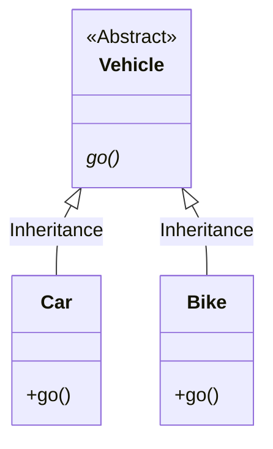

## Abstract

### Abstract Class
- An abstract class cannot be instantiated
- The purpose of it is mainly for inheritance
- It may contain one or more abstract method
 
### Abstract Method
  - declared without implementation (no method body)
  - force the child classes of the class to implement the abstract method 

###  Example

```java
//superclass
public abstract class Vehicle{
	abstract void go();	
} 
```
```java
//subclass
public class Car extends Vehicle{
	@Override
	void go(){
		System.out.println("The driver is driving the car");
	}
}
```
```java
//subclass
public class Bike extends Vehicle{
	@Override
	void go(){
		System.out.println("The driver is riding on the bike");
	}
}
```
```java
public class VehicleTest{
	public static void main(String[] args){
		Car car = new Car();
		Bike bike = new Bike();

		car.go();
		bike.go();
	}
}
```
Output :
```
The driver is driving the car
The driver is riding on the bike
```