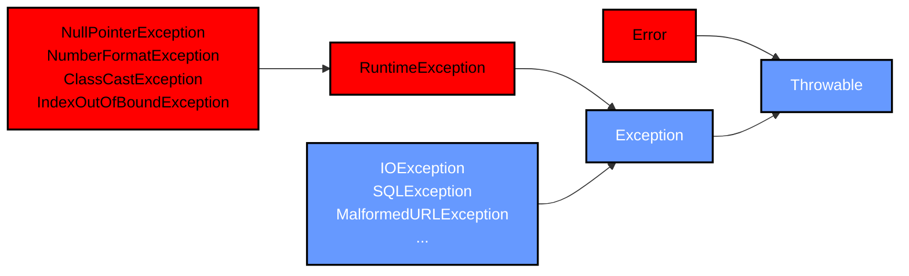

# Exception
|Table of Content|
|---|
||
---
## What is Exception in Java ?
- Problem that arises during the execution of a program
- It occur due to different reasons. For example:
    - invalid data is entered
    - A file that needs to be opened cannot be found
    - Network connection lost
    - JVM has run out of memory

[Back To Top](#exception)

---
## Category of exception

### Checked Exception
- 
### Unchecked Exception
- 
### Error
- 

[Back To Top](#exception)

---