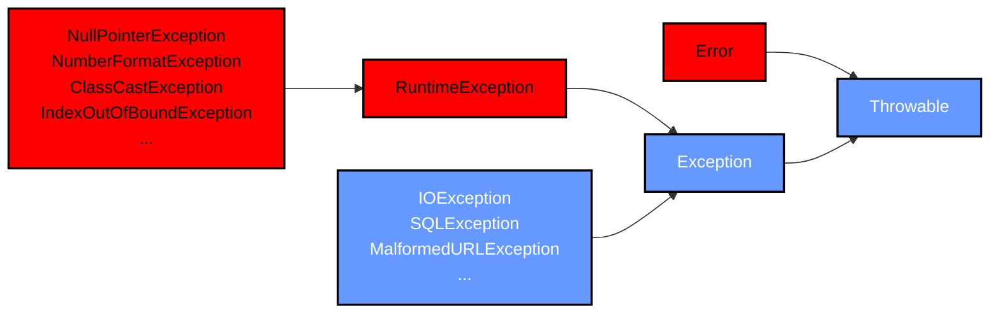
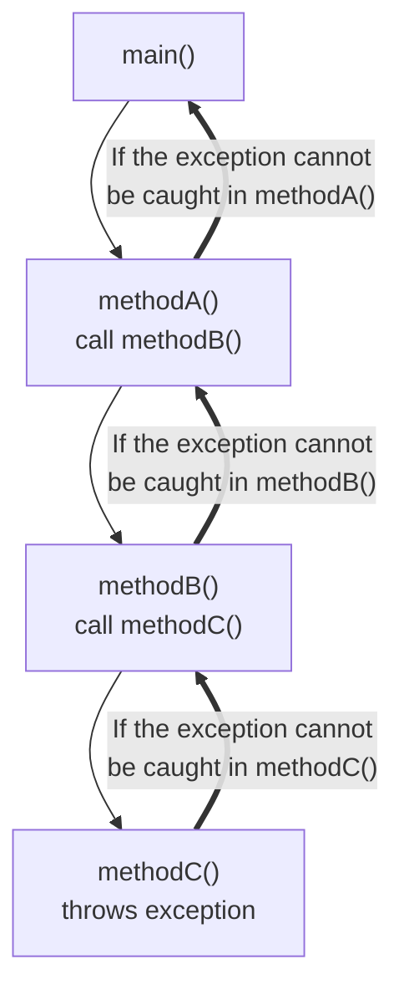

# Exception
|Table of Content|
|---|
|[]()|
---
## What is Exception in Java ?
- Problem that arises during the execution of a program
- It occur due to different reasons. For example:
    - invalid data is entered
    - A file that needs to be opened cannot be found
    - Network connection lost
    - JVM has run out of memory

[Back To Top](#exception)

---
## Category of exception

### Checked Exception
- a user error or a problem that ***cannot be foreseen by a programmer***
- file to be opened cannot be found
- MUST BE handled in the codes
### Unchecked Exception
- AKA Runtime exception
-  An exception that occurs that could have been avoided by the programmer by doing more checks

### Error
- It is not exception
- it is a problem that arise beyond the control of the user or the programmer
- e.g. If stack overflow occurs and out of memory , an error will arise

[Back To Top](#exception)

---
## Ways of Handling an Exception
1. do not handle exception at all
2. handle the exception where it occurs
3. handle the exception at another point in the program

[Back To Top](#exception)

---
## Catching an Exception
- A try-catch block is placed aorund the code that might generate an exception
- Protected code -> code within a try-catch block
```java
// syntax:
try{
    // protected block
}catch(Exception e){
    // catch block
}
```
### Finally
- used to create a block of code that follows a try block 
- code inside always executes whether an exception has occured
```java
try{
    // protected block
}catch(ExceptionType1 e1){
    // catch block
}catch(ExceptionType2 e2){
    // catch block
}finally{
    // The finally block always executes
}
```

[Back To Top](#exception)

---
## Method Throws Exception
- If the method does not handle a [check exception](#checked-exception), the method must declare it by using the **throws** keyword
- It appeared at the end of the signature
```java
public static void main(String[] args) throws FileNotFoundException{
    // This might throw an exception if file not found
    // It will throw to main method and display on the console
    Scanner fileScanner = new Scanner(new File("StudentMarks.dat"));
}
```
Output :
```
Exception in thread "main" java.io.FileNotFoundException: StudentMarks.dat (No such file or directory)
	at java.base/java.io.FileInputStream.open0(Native Method)
	at java.base/java.io.FileInputStream.open(FileInputStream.java:212)
	at java.base/java.io.FileInputStream.<init>(FileInputStream.java:154)
	at java.base/java.util.Scanner.<init>(Scanner.java:639)
	at Main.main(Main.java:8)
```
---
## Exception Propagation
- If exception is not caught and handled where it occurs, control is immediately returned to the method that invocked the method that produced the exception
- This process keep continuing until the exception is caught and handled or until it passed out of main method (terminates the program and produce the exception message)

### Explanation with diagram

- It search the ordered list of the methods that had been called to get to the method where the error occured
- Call stack -> the list of methods
- runtime system searchs the call stack for a method that contains an exception handler for the given exception

[more example of exception propagation with code implementation]() 

[Back To Top](#exception)

---

## Creating your own Exception
[click to view the code]()

---
## Assertion
- primarilt for debugging and identifying logic error in an application

|Assertion|vs|Exception|
|---|---|---|
|to assure the corectness of the program||deals with unusual circumstances during program execution|
|addresses correctness||addresses robustness|
|used for internal consistency and validity checks||can be used for normal test|
