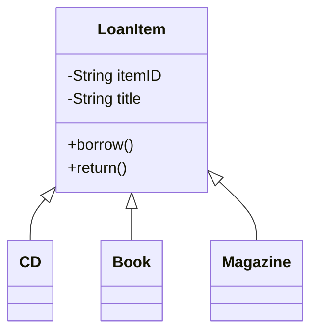
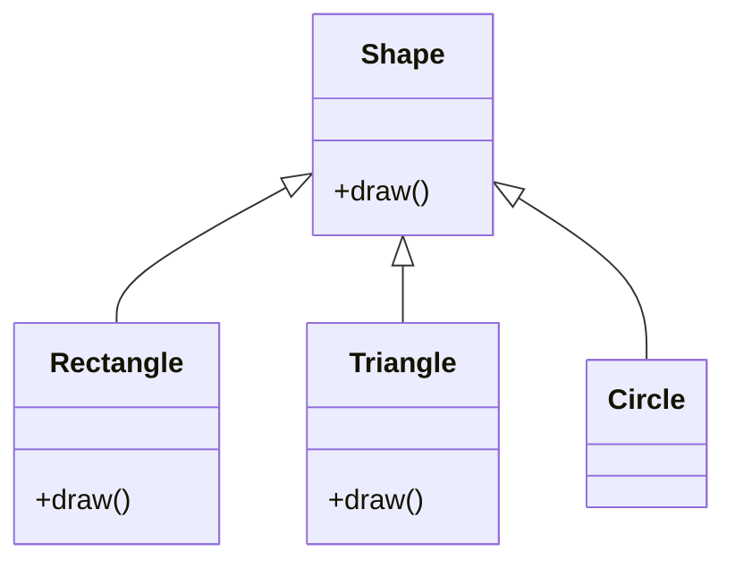

## Inheritance
- Object of diffrent classes may share the common properties and behaviours
- Example : Library System
- Types of items for loans:
    - CD
    - books
    - magazine
- These items shared some of the common propertis.
- Thus a [**superclass**](#superclass) "LoanItem" is defined
- CD, Book and Magazine classes inherits from LoanItem class
- Those classes inherit from superclass are called [**subclasses**](#subclass)

---

## Superclass
- defines the common properties and behaviours

## Subclass
- inherits all attributes and methods from its superclass
- has its own special attributes and methods

## Relationship between superclass and subclass

- Inheritance establish "is-a(type of)" relationship to them
- CD is a type of LoanItem
- Books is a type of LoanItem
- Magazine is a type of LoanItem


---
## How to inherit from a superclass in JAVA?
- Using **extends** keyword
```java
public class LoanItem{
	private String itemID;
	private String title;
	// constructor in a superclass
	public LoanItem(String itemID; String title){
		this.itemID = itemID;
		this.title = title;
	} 

	public void borrow(){
		...
	}
	public void return(){
		...
	}
}
```
```java
public class CD extends LoanItem{
	private String singer;
	//other special attributes and method of CD
	...
}
```
---
## Super Reference
- reserved keyword
- refers to the corresponding superclass
- - used by the subclasses to access members of their superclass
```java
public class CD extends LoanItem{
	private String singer;
	
	// constructor in a subclass
	public CD(String itemID; String title, String singer){
		super(itemID,title); 			// call the constructor of its superclass
		this.singer = singer;
	}
}
```
- When do we use **super** keyword?
	- access super class constructor
	- access an overridden method in super class from subclass (later) 
---
## Constructor in subclasses
- Subclass does to inherit constructor from super constructor
- Subclass must call the super class constructor
- The calling may be 
<details>
<summary>**implicit** when <ins>there is a</ins> default constructor</summary>
		
```java
public class SuperConstructor{
	public SuperConstructor(){	//this is a default constructor as it does not take in any parameter
		System.out.println("In SuperContructor");
	}
}
```

```java
public class SubConstructor extends SuperContructor{
	public SubConstructor(){
		// the super class default constructor will be called implicitly
		System.out.println("In SubContructor");
	}
	
	public static void main(String[] args){
		SubConstructor sub = new SubConstructor();
	}
}
```
Output : 
```
In SuperContructor
In SubContructor
```
</details>
<details>
<summary>**explicit** when <ins>there is no</ins> default constructor</summary>

```java
public class SuperConstructor{
	public SuperConstructor(String msg){	//this is not a default constructor as it takes in parameter(s)
		System.out.println(msg);
	}
}
```
```java
public class SubConstructor extends SuperContructor{
	public SubConstructor(){
		super("Calling super class constructor");
		System.out.println("In SubContructor");
	}
	
	public static void main(String[] args){
		SubConstructor sub = new SubConstructor();
	}
}
```
Output : 
```
Calling super class constructor
In SubContructor
```
</details>

---
## Private vs Protected 
<table>
<tr>
<th>Private Mambers</th>
<th></th>
<th>Protected Members</th>
</tr>
<tr>
<td>not accessible by its subclasses</td>
<td>Properties</td>
<td>only accessible by its subclasses</td>
</tr>
<tr>
<td>

```java
public class LoanItem{
	private String itemID;
	private String title;
}
```
```java
public class CD extends LoanItem{
	private String singer;
	
	// constructor in a subclass
	public CD(String itemID; String title, String singer){
		this.itemID = itemID;	// X DIRECT access to superclass's private member is NOT allowed
		this.title = title;		// X DIRECT access to superclass's private member is NOT allowed
		this.singer = singer;
	}
}
```

</td>
<td>Example Code</td>
<td>

```java
public class LoanItem{
	protected String itemID;
	protected String title;
}
```
```java
public class CD extends LoanItem{
	private String singer;
	
	// constructor in a subclass
	public CD(String itemID; String title, String singer){
		this.itemID = itemID;	// DIRECT access to superclass's private member is allowed
		this.title = title;		// DIRECT access to superclass's private member is allowed
		this.singer = singer;
	}
}
```

</td>
</tr>
</table>

---

## Method Signature
- Method in JAVA comprises of :
	- Access modifier
	- Return type
	- Method name
	- Parameter list
	- Method body
- While Method signature comprises of:
	- Method name
	- Parameter list
### Method overload
- method with the same name but different signature
- JAVA match the name and the parameter list automatically to determine which method to call
```java
import java.lang.Math;

public class SignatureDemo{
	private double weight;
	private double height;

	public void setWeight(double weight){	//kg
		this.weight = weight;
	}
	public void setWeight(int weight){	//g
		this.weight = (double) weight/1000;
	}

	public void setHeight(double height){	//m
		this.height = height;
	}
	public void setHeight(int height){	//cm
		this.height = (double) height/100;
	}
	
	public double calcBMI(){
		double bmi =  weight / Math.pow(height,2.0)
		return roundOffToTwoDecimalPlaces(bmi);
	}
	public double roundOffToTwoDecimalPlaces(double num){
		return (double) Math.round(num*100)/100;
	}
	
	public static void main(String[] args){
		SignatureDemo person1 = new SignatureDemo();
		person1.setweight(77.5);		// take in double 
		person1.setHeight(1.75);		// take in double 
		double p1_bmi = person1.calcBMI();
		System.out.println("Person 1's BMI is " + p1_bmi);
		SignatureDemo person2 = new SignatureDemo();
		person2.setweight(67500);		// take in integer 
		person2.setHeight(165);			// take in double 
		double p1_bmi = person1.calcBMI();
		System.out.println("Person 2's BMI is " + p1_bmi);
	} 
}
```
Output :
```
Person 1's BMI is 25.31
Person 2's BMI is 24.79
```
---
##  Method override
- Apply in subclass when superclass method is "not suitable"
- Same method signature but different method body

```java
//superclass
public class Shape{
	public void draw(){
		System.out.println("This is a shape");
	}
}
```
```java 
//subclass
public class Rectangle{
	@Override
	public void draw(){
		System.out.println("This is a rectangle");
	}
}
```
```java 
//subclass
public class Triangle{
	@Override
	public void draw(){
		super.draw();
		System.out.println("This is a triangle");
	}
}
```
```java 
//subclass
public class Circle{
	//inherit draw() from Shape
}
```
```java
public class ShapeTest{
	public static void main(String[] args){
		Shape shape = new Shape();
		Rectangle rectangle = new Rectangle();
		Triangle triangle = new Triangle; 
		Circle circle = new Circle();
		
		shape.draw();System.out,println();
		rectangle.draw();System.out,println();
		triangle.draw();System.out,println();
		circle.draw();System.out,println();
	}
}
```
Output :
```
This is a shape

This is a rectangle

This is a shape
This is a triangle

This is a shape
```