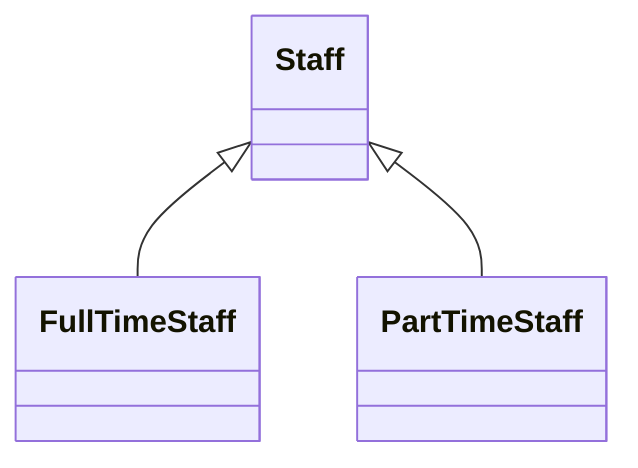

# Polymorphism

## Meaning of polymorphism
- Poly  -> many
- Morph -> change to something
- Polymorphism -> ability of an object to take on many forms 
- This can be achived by 
    - [Polymorphism by Inheritance](#polymorphism-by-inheritance)
    - [Polymorphism by Interface](#polymorphism-by-interface) 

## Polymorphism by Inheritance
[learn more about inheritance](https://github.com/BensonNgu/java/tree/main/Java%20notes/Inheritance)

```java
//superclass
public class staff{
    private String empNum;
    private String name;
    private String dept;
    private double monthlyPay;
    
    public Staff(String empNum, String name, String dept, double monthlyPay){
        this.empNum = empNum;
        this.name = name;
        this.dept = dept;
        this.monthlyPay = monthlyPay;
    }
    public String getEmpNum(){return this.empNum;}
    pubiic String getName(){return this.name;}
    pubiic String getDept(){return this.dept;}
    pubiic double getMonthlyPay(){return this.monthlyPay;}
    
    public double calcPay(){
        return this.monthlyPay;
    }

    public String toString(){
        return this.empNum + " " + this.name + " " + this.dept;
    }
}
```
```java
//subclass
public class FullTimeStaff extends Staff{
    public double allowance;

    public FullTimeStaff(String empNum, String name, String dept, double monthlyPay,double allowance){
        super(empNum, name, dept, monthlyPay);
        this.allowance = allowance;
    }

    @Override
    public double calcPay(){
        return getMonthlyPay() + this.allowance;
    }
}
```
```java
//subclass
public class PartTimeStaff extends Staff{
    public double hoursWorked;
    public double hourlyRate;

    public PartTimeStaff(String empNum, String name, String dept, double monthlyPay,double hoursWorked, double hourlyRate){
        super(empNum, name, dept, monthlyPay);
        this.hoursWorked = hoursWorked;
        this.hourlyRate = hourlyRate;
    }

    @Override
    public double calcPay(){
        return this.hoursWorked * this.hourlyRate;
    }
}
```
```java
public class StaffTest{
    public static void main(String[] args){
        Staff s1 = new Staff("001","Peter","IT",10000);
        Staff s1 = new FullTimeStaff("002","John","Acc",5000,300);
        Staff s1 = new PartTimeStaff("T01","Tim","Sales",10,50);

        // printing all staff info
        System.out.println(s1);
        System.out.println(s2);
        System.out.println(s3);

        // calculate all staff pay
        System.out.println(s1.calcPay());
        System.out.println(s2.calcPay());
        System.out.println(s3.calcPay());
    }
}
```
Output :
```
001 Peter IT
002 John Acc
T01 Tim Sales
10000.0
5300.0
500.0
```
- All child object of a superclass can be added to the arraylist of the type of superclass
```java
public class StaffTest{
    public static void main(String[] args){
        Staff s1 = new Staff("001","Peter","IT",10000);
        Staff s1 = new FullTimeStaff("002","John","Acc",5000,300);
        Staff s1 = new PartTimeStaff("T01","Tim","Sales",10,50);
        ArrayList<Staff> staffs = new ArrayList<Staff>();
        staff.add(s1);
        staff.add(s2);
        staff.add(s3);

        // printing all staff info and calculate pay using loop
        for(Staff staffObj : staffs){
            System.out.println(staffObj);
            System.out.println(staffObj.calcPay());
        }
    }
}
```
Output :
```
001 Peter IT
10000.0
002 John Acc
5300.0
T01 Tim Sales
500.0
```
- Assume that in the HR system, there is no need for a Staff object
- We can make the superclass as abstract
```java
//superclass
public abstract class staff{
    private String empNum;
    private String name;
    private String dept;
    private double monthlyPay;
    
    public Staff(String empNum, String name, String dept, double monthlyPay){
        this.empNum = empNum;
        this.name = name;
        this.dept = dept;
        this.monthlyPay = monthlyPay;
    }
    public String getEmpNum(){return this.empNum;}
    pubiic String getName(){return this.name;}
    pubiic String getDept(){return this.dept;}
    pubiic double getMonthlyPay(){return this.monthlyPay;}
    
    abstract public double calcPay();      // The subclasses that inherit this class must override this method

    public String toString(){
        return this.empNum + " " + this.name + " " + this.dept;
    }
}
```

[back To Top](#polymorphism)

---

## Polymorphism by Interface
[learn more about interface](https://github.com/BensonNgu/java/tree/main/Java%20notes/Interface)
- In the previous example all FullTimeStaff and PartTimeStaff need to have a calcPay() method
- Thus we can create an interface
```java
public interface HRPay{
    // by default any method declared in an interface are abstract
    public double calcPay();
}
```
```java
//superclass
public class staff implements HRPay{
    private String empNum;
    private String name;
    private String dept;
    private double monthlyPay;
    
    public Staff(String empNum, String name, String dept, double monthlyPay){
        this.empNum = empNum;
        this.name = name;
        this.dept = dept;
        this.monthlyPay = monthlyPay;
    }
    public String getEmpNum(){return this.empNum;}
    pubiic String getName(){return this.name;}
    pubiic String getDept(){return this.dept;}
    pubiic double getMonthlyPay(){return this.monthlyPay;}
    
    public double calcPay(){
        return this.monthlyPay;
    }

    public String toString(){
        return this.empNum + " " + this.name + " " + this.dept;
    }
}
```
- Besides, any interface can also be a datatype
```java
public class HRPayTest{
    public static void main(String[] args){
        HRPay s1 = new Staff("001","Peter","IT",10000);
        HRPay s1 = new FullTimeStaff("002","John","Acc",5000,300);
        HRPay s1 = new PartTimeStaff("T01","Tim","Sales",10,50);

        // calculate all staff pay
        System.out.println(s1.calcPay());
        System.out.println(s2.calcPay());
        System.out.println(s3.calcPay());
    }
}
```
Output :
```
10000.0
5300.0
500.0
```
- s1, s2 and s3 are of the type “HRPay”
- It does not care which “datatype” is attached to s1,s2 or s3
- All it cares is that it has the method calculatePay().
- This is also known as “[Late-binding]()”
- The actual “datatype” is only “binded” 
- into the variable during “run time”

[back To Top](#polymorphism)