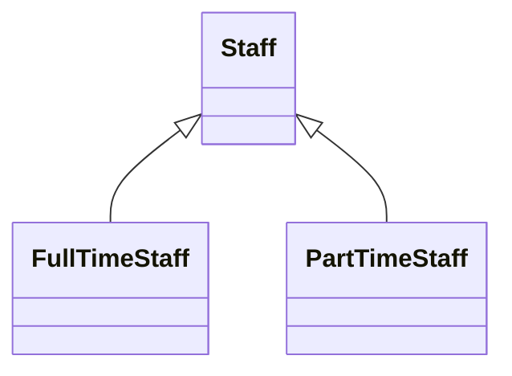

# Polymorphism

## Meaning of polymorphism
- Poly  -> many
- Morph -> change to something
- Polymorphism -> ability of an object to take on many forms 
- This can be achived by 
    - [Polymorphism by Inheritance](#polymorphism-by-inheritance)
    - [Polymorphism by Interface](#polymorphism-by-interface) 

## Polymorphism by Inheritance
[learn more about inheritance](https://github.com/BensonNgu/java/tree/main/Java%20notes/Inheritance)

[back To Top](#polymorphism)

---

## Polymorphism by Interface
[learn more about interface](https://github.com/BensonNgu/java/tree/main/Java%20notes/Interface)

[back To Top](#polymorphism)